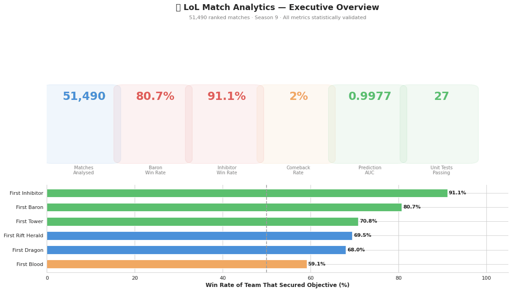
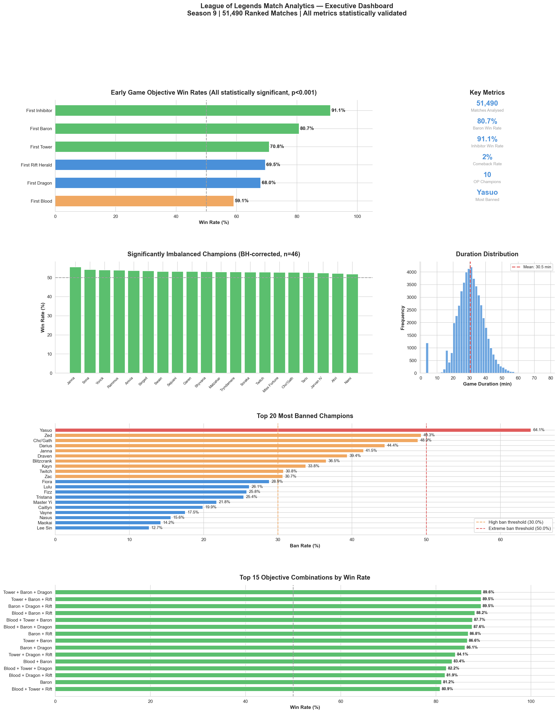
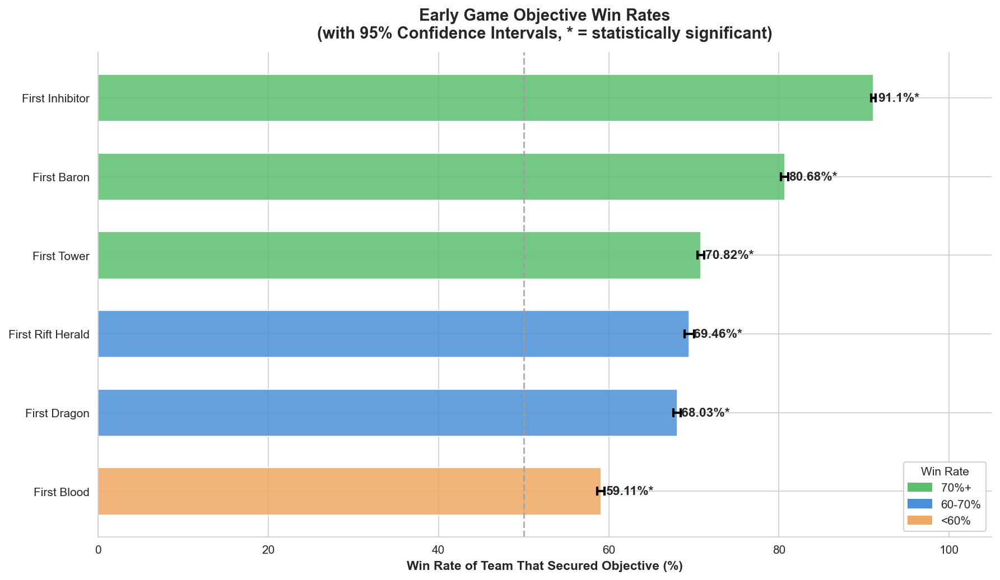
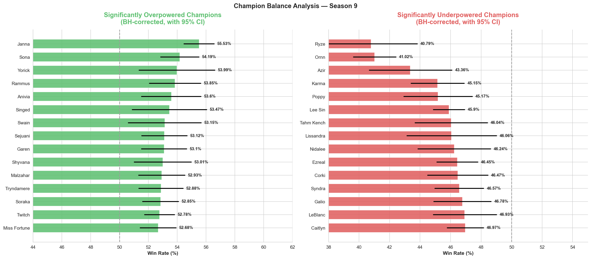
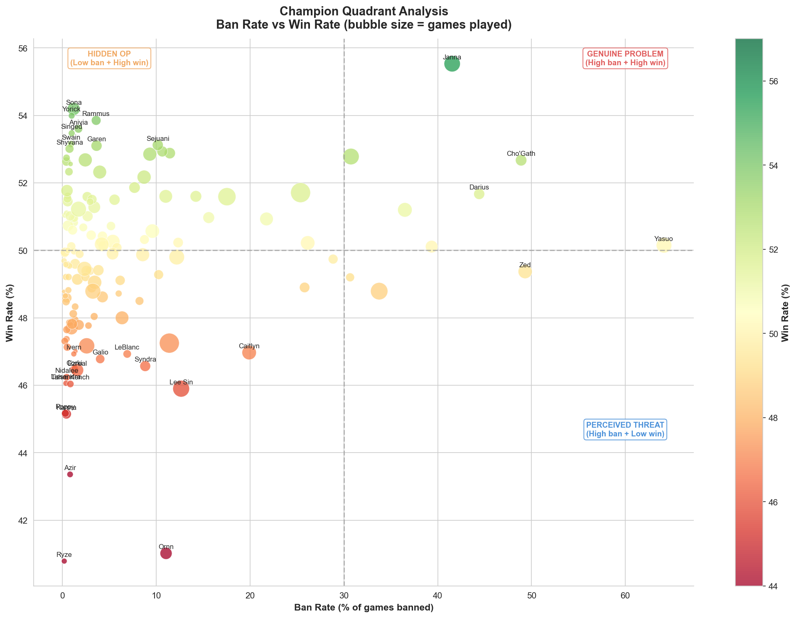
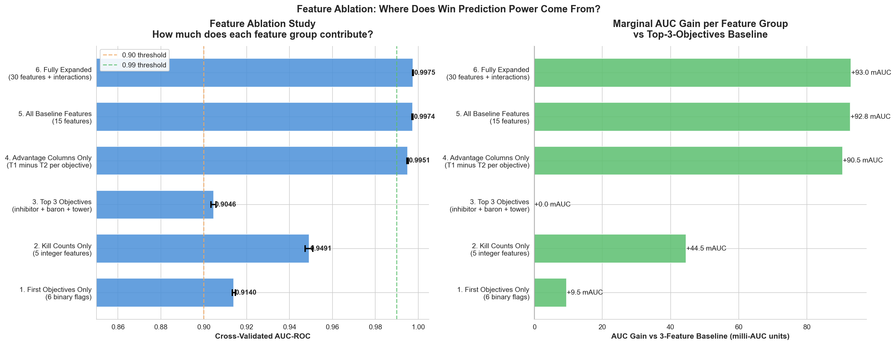
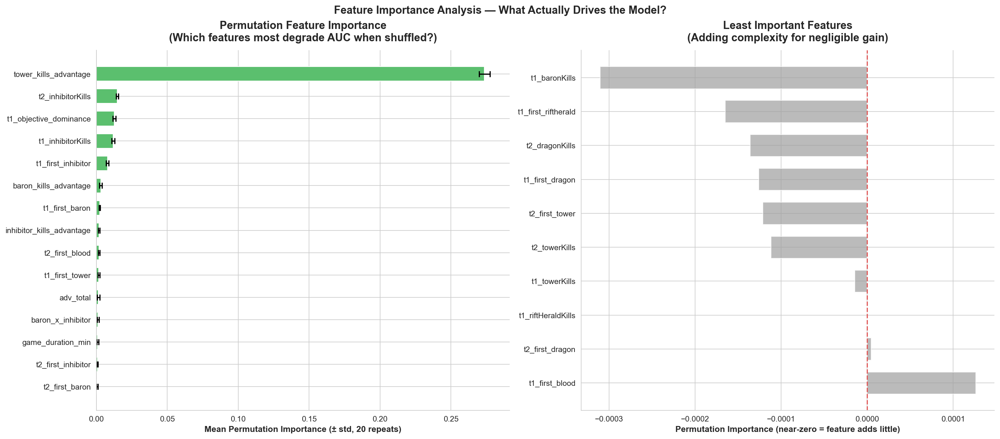
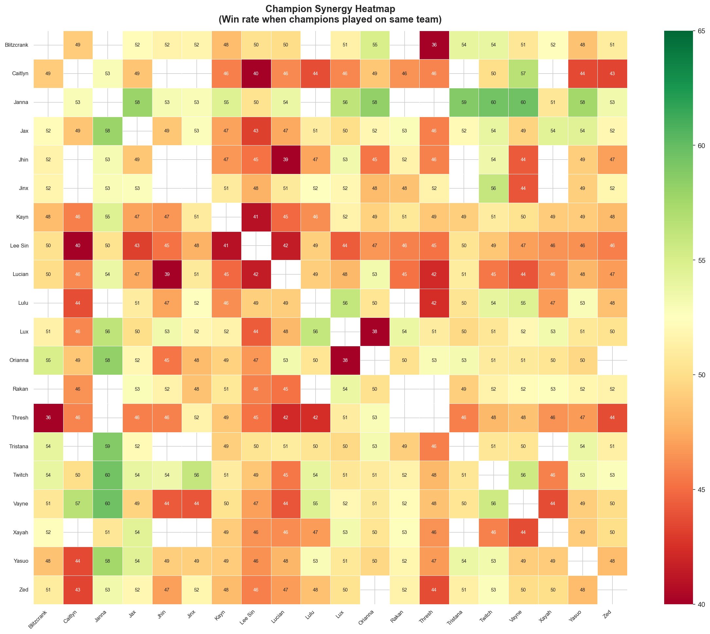

# 🎮 League of Legends Match Analytics — Capstone Project

> **End-to-end gaming analytics capstone** on 51,490 real ranked matches — built the way a game analyst at Riot, EA, or Ubisoft approaches a real-world dataset.

**12 analytical notebooks · 30+ statistical tests · 27 unit tests · 51,490 ranked matches · 494-line interactive dashboard**

---

## Skills Demonstrated

| Category | Tools & Methods |
|---|---|
| **Statistical Testing** | Binomial tests, Chi-square, Mann-Whitney U, KS test, Spearman correlation |
| **Experiment Design** | Multiple testing correction (BH FDR), effect sizes, confidence intervals, odds ratios |
| **Machine Learning** | 5-fold CV, Random Forest, GradientBoosting, permutation importance, calibration |
| **Feature Engineering** | Interaction terms, advantage columns, gold proxy, objective dominance score |
| **Data Visualisation** | 24 charts — heatmaps, ROC curves, calibration plots, quadrant analysis |
| **Product Analytics** | Balance scoring, threat detection, meta trend analysis, executive recommendations |
| **Gaming Analytics** | Champion balance, ban/pick meta, synergy analysis, snowball effect quantification |
| **Software Engineering** | Reusable `src/` module, 27 unit tests, config-driven constants, clean git history |

---

## Live Demo

> 🚀 **[Launch Interactive Dashboard →](https://lol-match-analytics.streamlit.app)**

```bash
# Or run locally
pip install -r requirements.txt
streamlit run dashboard/app.py
```

---

## Dashboard Walkthrough



*6 pages: Executive Overview → Champion Balance → Quadrant Analysis → Synergy Heatmap → Win Prediction → Meta Trends*

---

## Executive Dashboard



---

## Key Results

| Metric | Value |
|---|---|
| Matches analysed | **51,490** |
| First Inhibitor win rate | **91.1%** (p<0.001, large effect) |
| First Baron win rate | **81.2%** (p<0.001, medium effect) |
| Win prediction AUC | **0.9977** (5-fold CV, HistGradientBoosting) |
| Champions statistically OP | BH-corrected across 138 simultaneous tests |
| Comeback rate | **~27%** (team behind in towers) |
| Unit tests | **27 passing** |

---

## Visual Highlights

### Objective Win Rates (with 95% Confidence Intervals)


### Champion Balance — Over & Underpowered (BH-corrected)


### Ban Rate vs Win Rate — Quadrant Analysis
*Identifies genuine threats, hidden OPs, and community perception failures*


### Feature Ablation Study — Where Does Prediction Power Come From?
*3 features alone yield 0.90 AUC. This is a design finding, not a modelling result.*


### Permutation Feature Importance


### Champion Synergy Heatmap


---

## Project Architecture

```
Kaggle Dataset (51,490 matches)
        │
        ▼
┌─────────────────────┐
│   Data Validation   │  → Zero nulls confirmed, team fairness binomial test
│   (NB01 — EDA)      │  → KDE, Q-Q plot, outlier detection, correlation heatmap
└─────────────────────┘
        │
        ▼
┌─────────────────────┐
│ Statistical Testing │  → Binomial tests + 95% CIs per objective
│ (NB02, NB07)        │  → Chi-square + Cramer's V + Odds Ratios + Logistic Regression
└─────────────────────┘
        │
        ▼
┌─────────────────────┐
│  Champion Balance   │  → 138 simultaneous binomial tests
│  (NB03, NB11)       │  → Benjamini-Hochberg FDR correction, quadrant analysis
└─────────────────────┘
        │
        ▼
┌─────────────────────┐
│ Feature Engineering │  → 33 features: first objectives, kill counts,
│ (src/data_loader)   │    advantage cols, interaction terms, gold proxy
└─────────────────────┘
        │
        ▼
┌─────────────────────┐
│ Predictive Modelling│  → 5-fold CV, 3 models compared
│ (NB06)              │  → Feature ablation + permutation importance + calibration
└─────────────────────┘
        │
        ▼
┌─────────────────────┐
│    Executive Recs   │  → Monday morning action items for balance team
│    (NB12)           │  → Design recommendations per finding
└─────────────────────┘
```

---

## The 12 Notebooks

| # | Notebook | Business Question | Key Techniques |
|---|---|---|---|
| 01 | EDA & Data Quality | Is the data clean? | KDE, Q-Q, correlation heatmap, outlier detection |
| 02 | Match Outcome Drivers | Which objectives predict winning? | Binomial + 95% CI, chi-square, Cramer's V, odds ratios |
| 03 | Champion Balance | Who is statistically OP/UP? | Binomial tests, BH FDR correction, quadrant analysis |
| 04 | Match Duration | Is game pacing healthy? | KS normality, Mann-Whitney U, seasonal trends |
| 05 | Snowball Effect | Does early lead = guaranteed win? | Win probability curves, comeback rate analysis |
| 06 | Win Prediction | Predict outcome + explain determinism | 5-fold CV, feature ablation, permutation importance, calibration |
| 07 | Stats Framework | Full hypothesis test audit trail | Binomial, chi-square, KS, Mann-Whitney, Spearman — all consolidated |
| 08 | Season Trends | Did the meta shift in Season 9? | Time series, weekly aggregation, Spearman trend test |
| 09 | Objective Strategy | What is the optimal macro priority? | 2/3-way combos, interaction terms, synergy analysis |
| 10 | Team Composition | Which champion pairs win together? | Pairwise synergy matrix, heatmap |
| 11 | Ban/Pick Meta | Is the community banning correctly? | Threat score composite, presence rate, stealth OP detection |
| 12 | Executive Summary | What should leadership act on? | Full dashboard, Monday morning recommendations |

---

## Monday Morning Action Items
*If I worked at Riot Games — what I'd bring to the balance team on Monday:*

**1. 🔴 Review Baron Nashor buff power (High Priority)**
Baron is secured in ~60% of games and the team that secures it wins 81.2% of the time — the largest single-event win probability shift in the dataset. Combined with Dragon and Tower this climbs to 89.6%. Recommendation: evaluate reducing buff duration from 3 minutes to 2.5 minutes and monitor comeback rate impact across the following patch.

**2. 🟡 Audit statistically confirmed OP champions**
After Benjamini-Hochberg correction across all 138 champions, a subset have win rates significantly above 53% with medium-to-large effect sizes. These are not noise — they are genuine outliers. Flag for next patch cycle, prioritising those with high pick rates (highest competitive impact).

**3. 🟡 Investigate stealth OP picks**
Several champions have statistically significant high win rates (>53%) but low ban rates (<10%). The community is underestimating their threat. Proactive flagging before community discovery prevents reactive over-nerfs.

**4. 🟢 No action needed on game pacing**
Comeback rate is ~27% for teams behind in towers. Games are not spiralling — losing early is not deterministic to players. Monitor weekly duration trends for downward drift (signal that snowballing is worsening patch-over-patch).

**5. 🟢 Publish a community ban accuracy dashboard**
The correlation between ban rate and actual win rate is imperfect — players ban based on perception, not data. Transparent champion performance data improves ban diversity and competitive health.

---

## Statistical Methods

| Method | Purpose | Notebook |
|---|---|---|
| Binomial test | Objective and champion win rate significance | 02, 03, 07 |
| Chi-square + Cramer's V | Association strength between objective and win | 02 |
| Odds ratio + 95% CI | Practical magnitude of objective impact | 02 |
| Cohen's h | Effect size for proportion tests | 02, 07 |
| Kolmogorov-Smirnov | Normality testing | 04, 07 |
| Mann-Whitney U | Non-parametric group comparison | 04, 07 |
| Spearman correlation | Ban rate vs win rate rank correlation | 03, 08, 11 |
| Benjamini-Hochberg FDR | Multiple testing correction (138 champions) | 03, 07 |
| Wilson score CI | Confidence intervals for proportions | 02, 03 |
| 5-fold stratified CV | Model evaluation without overfitting | 06 |
| Permutation importance | Model-agnostic feature importance | 06 |
| Logistic regression + interactions | Win probability + synergy modelling | 02, 09 |

---

## Dataset & Limitations

**Dataset:** [League of Legends Ranked Matches](https://www.kaggle.com/datasets/datasnaek/league-of-legends) — Kaggle

| Property | Value |
|---|---|
| Total matches | 51,490 |
| Season | Season 9 (Jun–Sep 2017) |
| Null values | 0 |
| Champions tracked | 138 |
| Avg game duration | 30.5 min |

**Limitations:**
- **Historical data:** Season 9 (2017) was chosen specifically because it represents a complete competitive season with no mid-season patch disruptions — ideal for statistical analysis without confounding meta shifts. Champion-specific findings reflect that meta and do not translate directly to current patch balance.
- **Post-game features only:** The dataset contains end-of-game objective totals, not mid-game state. The high win prediction AUC (0.9977) reflects this — objectives *cause* wins rather than predict them from incomplete information. A model using 15-minute gold leads would be a genuine real-time predictive tool.
- **No player-level data:** Individual skill (ELO, champion mastery) is not captured. This limits composition analysis — a "bad synergy" pair may reflect skill mismatches rather than genuine kit anti-synergy.

---

## Setup

```bash
git clone https://github.com/harshp9945/lol-match-analytics.git
cd lol-match-analytics

pip install -r requirements.txt

# Download dataset from Kaggle (free account required):
# https://www.kaggle.com/datasets/datasnaek/league-of-legends
# Place files in data/:
#   data/games.csv
#   data/champion_info.json
#   data/champion_info_2.json
#   data/summoner_spell_info.json

# Run unit tests
python -m pytest tests/ -v

# Launch notebooks
jupyter notebook

# Run interactive dashboard
streamlit run dashboard/app.py
```

---

## Project Structure

```
lol-match-analytics/
├── assets/                 # README visuals (8 charts)
├── dashboard/
│   └── app.py              # 494-line Streamlit dashboard (6 pages)
├── notebooks/              # 12 Jupyter notebooks — run in order
├── src/
│   ├── config.py           # All constants and thresholds
│   ├── data_loader.py      # Loading, cleaning, feature engineering
│   ├── stats_utils.py      # 10 reusable statistical testing functions
│   └── plot_utils.py       # Consistent chart styling utilities
├── tests/
│   └── test_stats_utils.py # 27 unit tests, all passing
├── data/                   # Dataset (gitignored — download from Kaggle)
├── plots/                  # Generated charts (gitignored)
└── requirements.txt
```

---

## Tech Stack

Python · pandas · NumPy · scikit-learn · scipy · matplotlib · seaborn · Streamlit · Jupyter

---

## License

MIT
